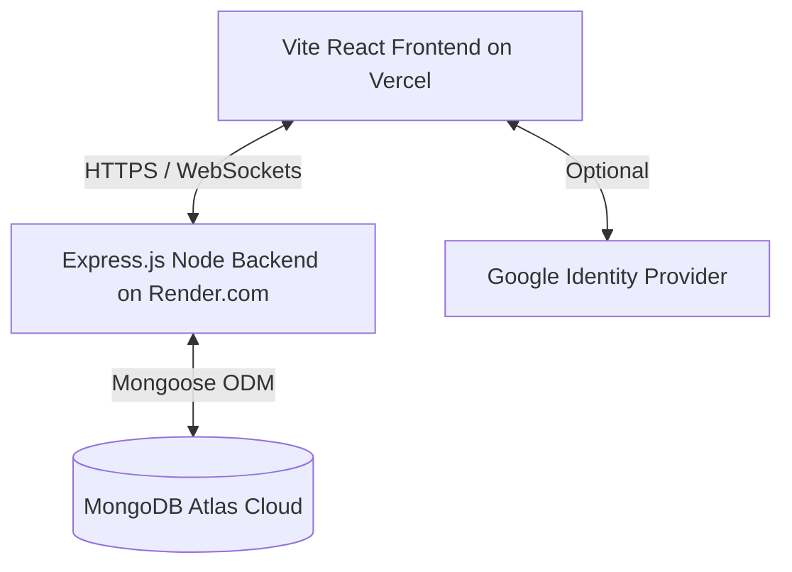

# Task Tracker

A high-fidelity, desktop-restricted real-time Task Management System with integrated chat, role permissions (Admin, Manager, User), timesheet logging with geolocation, and encrypted file sharing.

## Deployment

### Architecture Diagram



### Environment Variables

#### Backend (Render.com / Local `.env`)
- `NODE_ENV`: `production` or `development`.
- `MONGO_URL`: MongoDB Atlas connection string.
- `JWT_SECRET`: Secret key for signing JSON Web Tokens.
- `ADMIN_INVITE_TOKEN`: Token required to register an Admin account (defaults to `011516`).
- `CLIENT_URL`: `https://tasks-tracker.thinklabdigitalsolutions.com`
- `CLIENT_URLS`: `https://task-manager-topaz-pi.vercel.app,https://tasks-tracker.thinklabdigitalsolutions.com` (comma-separated origins for production CORS).
- `PORT`: Port the Express server listens on (defaults to `8080`).
- `GOOGLE_CLIENT_ID`: Google OAuth Client ID.
- `GOOGLE_CLIENT_SECRET`: Google OAuth Client Secret.
- `GOOGLE_CALLBACK_URL`: `https://tasks-tracker.thinklabdigitalsolutions.com/auth/google/callback`

#### Frontend (Vercel / Local `.env`)
- `VITE_API_URL`: URL of the deployed backend server (e.g. `https://task-manager-backend-fpwb.onrender.com`).
- `VITE_GOOGLE_CLIENT_ID`: Google OAuth Client ID matching the backend credentials.

---

### Google Cloud Console OAuth Setup

To enable Google login on both production domains, configure your Web Client Credentials in the [Google Cloud Console](https://console.cloud.google.com/):

#### 1. Authorized JavaScript Origins
Add the following origins:
*   `http://localhost:5173` (for local development)
*   `https://task-manager-topaz-pi.vercel.app`
*   `https://tasks-tracker.thinklabdigitalsolutions.com`

#### 2. Authorized Redirect URIs
Add the following redirect URIs:
*   `http://localhost:5173/auth/google/callback` (for local development)
*   `https://task-manager-topaz-pi.vercel.app/auth/google/callback`
*   `https://tasks-tracker.thinklabdigitalsolutions.com/auth/google/callback`

---

### Local Setup Steps

1. **Clone the repository**:
   ```bash
   git clone https://github.com/Nagapranav15/Task-manager.git
   cd Task-manager
   ```

2. **Setup the Backend**:
   ```bash
   cd backend
   cp .env.example .env
   # Fill in the environment variables in .env
   npm install
   npm run dev
   ```

3. **Setup the Frontend**:
   ```bash
   cd ../frontend/Task-manager
   cp .env.example .env
   # Set VITE_API_URL=http://localhost:8080 in .env
   npm install
   npm run dev
   ```

---

### Deployment Steps

#### 1. Backend Deployment (Render.com)
1. Go to [Render.com Dashboard](https://dashboard.render.com/) and log in.
2. Click **New** -> **Blueprint**.
3. Connect your GitHub repository: `Nagapranav15/Task-manager`.
4. Render will parse `render.yaml` and prompt you for the required environment variables (`MONGO_URL`, `CLIENT_URLS`, etc.).
5. Provide your values and click **Approve / Apply**.
6. Render will build and deploy the backend automatically. Note down your backend URL (e.g. `https://task-manager-backend-fpwb.onrender.com`).

#### 2. Frontend Deployment (Vercel)
1. Install Vercel CLI: `npm i -g vercel`.
2. Navigate to the frontend directory: `cd frontend/Task-manager`.
3. Run `vercel --prod` to deploy.
4. Set the environment variables `VITE_API_URL` and `VITE_GOOGLE_CLIENT_ID`.
5. Vercel will build and deploy the frontend.

### Production URLs
- **Vercel Domains**: 
  - `https://task-manager-topaz-pi.vercel.app`
  - `https://tasks-tracker.thinklabdigitalsolutions.com`
- **Backend URL**: `https://task-manager-backend-fpwb.onrender.com`
